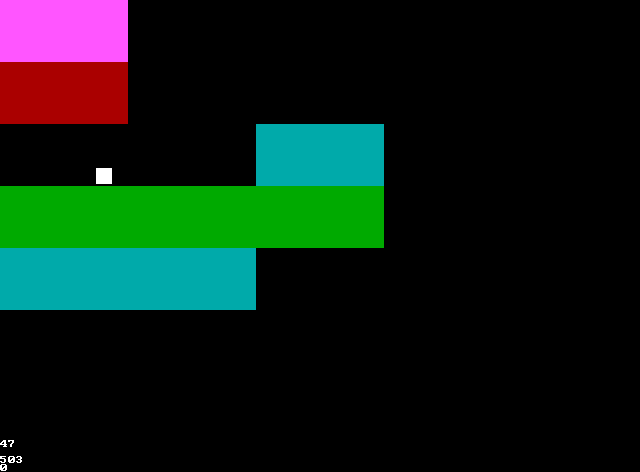
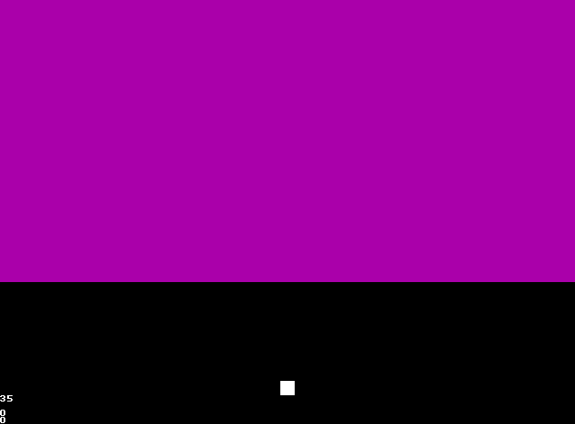
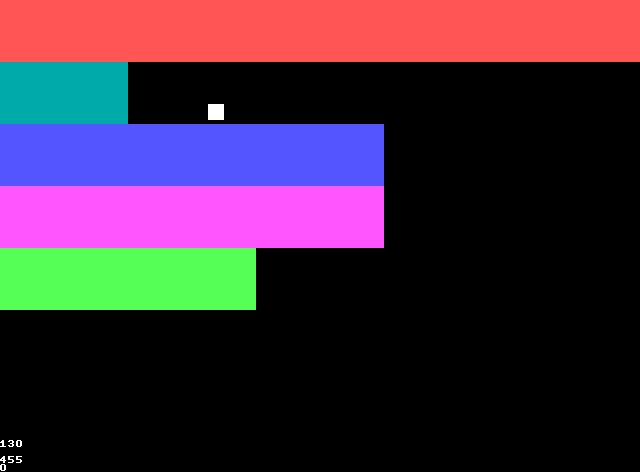
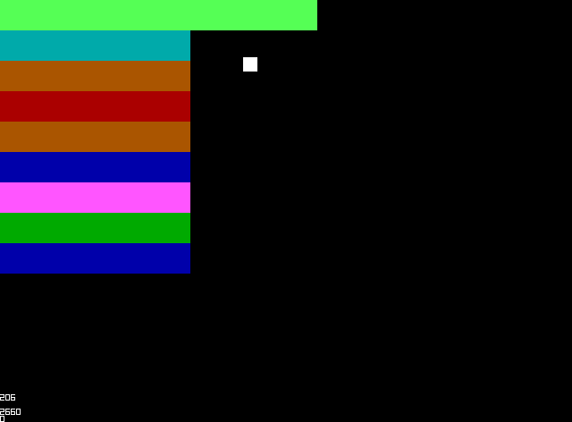
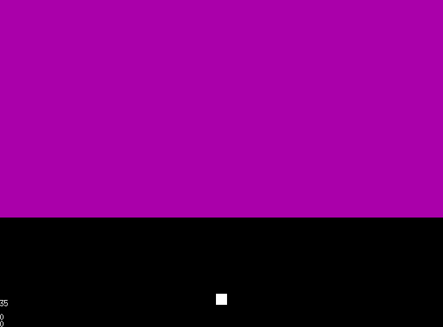
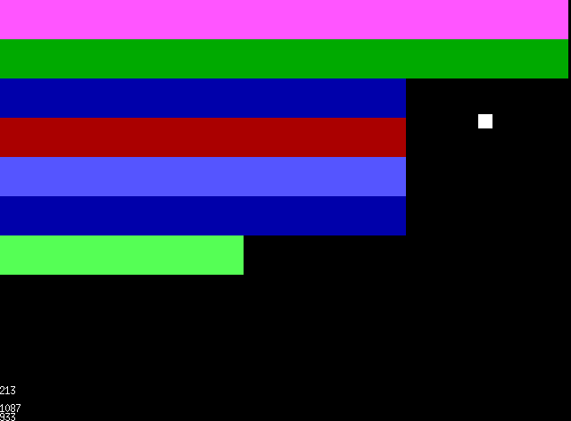
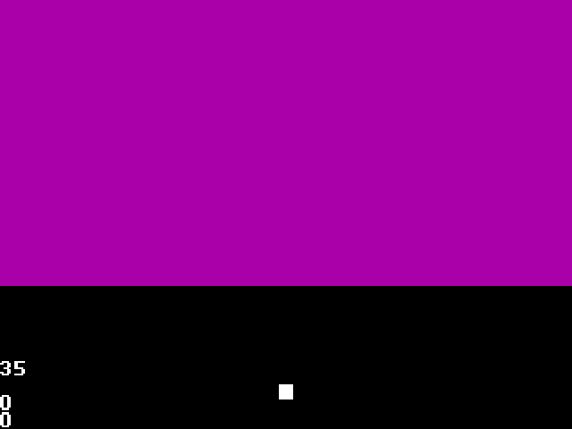
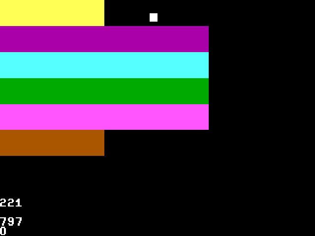
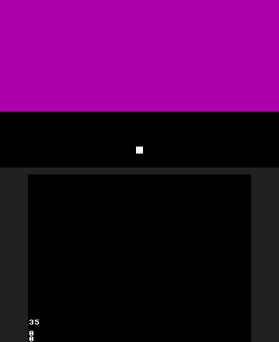
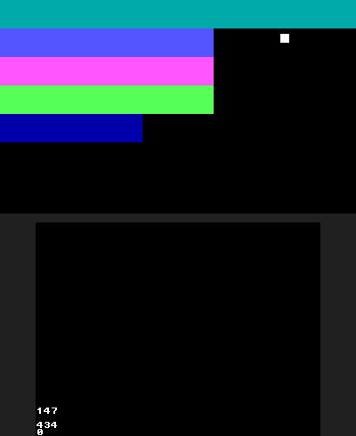

# BlockBreakC
A port of BlockBreakHC from HolyC to C

# Screenshots

SDL3

OpenGL (GLUT, GLFW3 and SDL3 + GL)

raylib

Xlib

DJGPP (MS-DOS)

citro2d (3DS/2DS) 

# Controls

| Key            | Action                                         | 
| -------------- | ---------------------------------------------- | 
| Up             | Move Up                                        | 
| Down           | Move Down                                      | 
| Left           | Move Left                                      | 
| Right          | Move Right                                     | 
| Enter          | Restart                                        | 
| Escape         | Quit                                           |
| S              | Screenshot (Only in screenshot enabled builds) |

# Controls (3DS/2DS)

| Button                           | Action                                         | 
| -------------------------------- | ---------------------------------------------- | 
| D-Pad Up, Circle Pad Up, X       | Move Up                                        | 
| D-Pad Down, Circle Pad Down, B   | Move Down                                      | 
| D-Pad Left, Circle Pad Left, Y   | Move Left                                      | 
| D-Pad Right, Circle Pad Right, A | Move Right                                     | 
| Select                           | Restart                                        | 
| Start                            | Quit                                           |
| L, R                             | Screenshot (Only in screenshot enabled builds) |