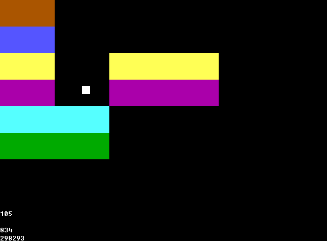

# [BlockBreakC-WASM](https://github.com/StevenSYS/BlockBreak/tree/c-wasm)
A JavaScript + HTML canvas implementation for BlockBreakC using WebAssembly

# Screenshots

# Controls

| Key                  | Action     |
| -------------------- | ---------- |
| Up                   | Move Up    |
| Down                 | Move Down  |
| Left                 | Move Left  |
| Right                | Move Right |
| Enter                | Restart    |
| S                    | Screenshot |
| Swipe (Touch Screen) | Move       |